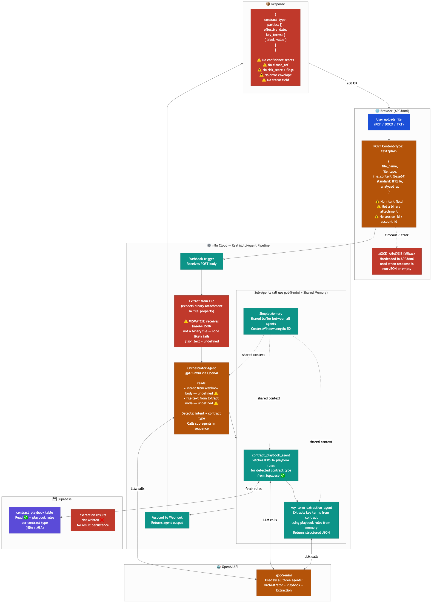
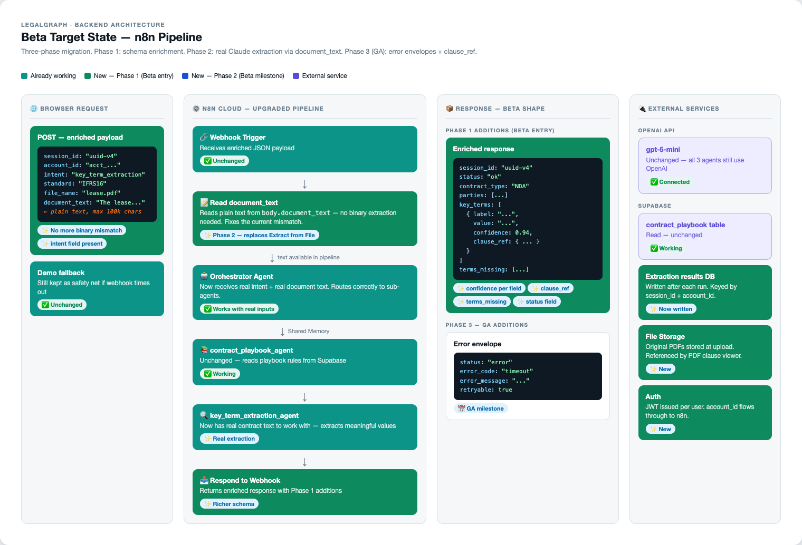

# Backend Architecture
**LegalGraph n8n Pipeline**
**Last updated: 2026-05-05**

---

## Current State

A real multi-agent AI pipeline running in n8n Cloud. Three OpenAI agents (Orchestrator → contract_playbook_agent → key_term_extraction_agent) share a Simple Memory buffer and a single gpt-5-mini LLM connection. Supabase is actively read for playbook rules but never written to. The pipeline cannot extract real contract data today because the frontend sends a base64-encoded JSON body — not a binary file — so n8n's `Extract from File` node receives `$json.text = undefined` and passes empty context to every downstream agent.

### Current State — Key Gaps

| Gap | Bug | Impact |
|-----|-----|--------|
| **Binary mismatch** — frontend sends base64 JSON, `Extract from File` expects binary `file` property | — | `$json.text = undefined`; all agents work with empty context; extraction produces nothing |
| **No `intent` field** — Orchestrator reads `body.intent` which is never set | — | Orchestrator cannot detect intent; sub-agent routing may produce wrong or empty output |
| **Response schema mismatch** — n8n returns `{contract_type, key_terms[]}`, frontend expects `{risk_score, flags[], terms_found[]}` | — | Frontend falls back to MOCK_ANALYSIS on every successful 200 response |
| No `confidence` scores in response | — | UI cannot distinguish reliable extractions from guesses |
| No `clause_ref` in response | BUG-006 | PDF viewer cannot be wired; audit trail has no source |
| No `session_id` / `account_id` in request | — | Per-account analytics and storage isolation impossible |
| No error envelope | — | UI shows generic error on any failure; no retry guidance |
| No `terms_missing` in response | — | UI cannot show which required fields were not found |
| Supabase never written to | BUG-009 | Extraction results not persisted; page refresh = data loss |

---

## Beta Target State

Fixes the core extraction gap by having the frontend extract `document_text` client-side (PDF.js / mammoth.js) and send it as plain text. n8n reads `document_text` directly — bypassing the broken `Extract from File` node — and the real OpenAI agent pipeline produces genuine extraction output. Response schema is aligned so the frontend renders real results instead of the MOCK_ANALYSIS fallback.

### Beta Target — Changes Required

| Change | Addresses | Priority |
|--------|-----------|----------|
| Frontend extracts `document_text` client-side (PDF.js + mammoth.js); sends as plain text | Binary mismatch | **P0 — fixes core extraction gap** |
| Add `intent: "key_term_extraction"` to POST payload | Missing intent field | **P0 — Beta entry** |
| n8n reads `document_text` from request body (bypass `Extract from File`) | Binary mismatch | **P0 — Beta entry** |
| Align n8n response schema to what frontend expects (or update frontend parser) | Schema mismatch | **P0 — Beta entry** |
| Add `confidence` per term to response | UX / trust | P1 — Beta milestone |
| Add `clause_ref` per term to response | BUG-006 | P1 — Beta milestone |
| Add `terms_missing` array to response | UX | P1 — Beta milestone |
| Add `status: ok / partial / error` to response | Error handling | P1 — Beta milestone |
| Supabase: write extraction results on every successful run | BUG-009 | P1 — Beta milestone |
| Add error envelope to response | Debuggability | P1 — Beta milestone |

---

## Payload Evolution Summary

### Request

| Field | Current | Beta |
|-------|---------|------|
| `file_name` | ✅ | ✅ |
| `file_type` | ✅ | ✅ |
| `file_content` (base64) | ✅ ⚠️ broken | — removed |
| `standard` | ✅ | ✅ |
| `analyzed_at` | ✅ | ✅ |
| `intent` | — missing ⚠️ | ✅ NEW |
| `session_id` | — | ✅ NEW |
| `account_id` | — | ✅ NEW |
| `document_text` | — | ✅ NEW — fixes binary mismatch |

### Response

| Field | Current | Beta |
|-------|---------|------|
| `contract_type` | ✅ | ✅ |
| `parties[]` | ✅ | ✅ |
| `effective_date` | ✅ | ✅ |
| `key_terms[].label/value` | ✅ | ✅ real extraction |
| `key_terms[].confidence` | — | ✅ NEW |
| `key_terms[].clause_ref` | — | ✅ NEW |
| `terms_missing[]` | — | ✅ NEW |
| `status` | — | ✅ NEW |
| `error_message` | — | ✅ NEW |
| `risk_score` / `flags[]` | — (frontend expects but n8n never sends) ⚠️ | TBD |

---

## Infrastructure

| Component | Current | Beta |
|-----------|---------|------|
| Webhook host | n8n Cloud (cfalcon.app.n8n.cloud) | n8n Cloud (same) |
| AI model | gpt-5-mini via OpenAI | gpt-5-mini via OpenAI (Claude stretch goal) |
| Supabase — playbook reads | ✅ Active | ✅ Active (unchanged) |
| Supabase — result writes | ❌ None | ✅ NEW |
| Supabase — auth | ❌ None | ✅ NEW (magic link) |
| File storage | None | Supabase Storage (for PDF viewer) |
| Frontend host | Netlify | Netlify (same) |
| Monitoring | n8n execution logs only | n8n logs + Supabase dashboard |

---

*Owner: Engineering · Reviewed by: AI, Product · Last updated: 2026-05-05*
