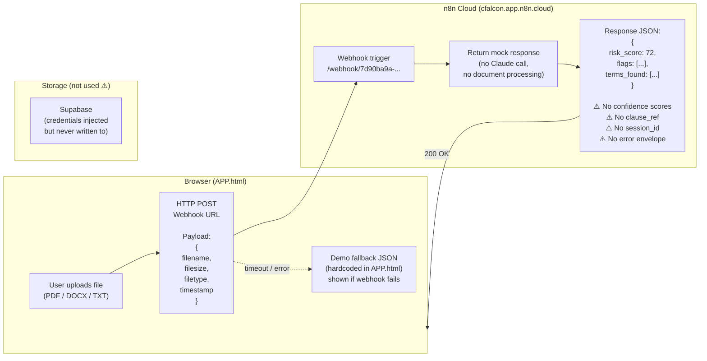
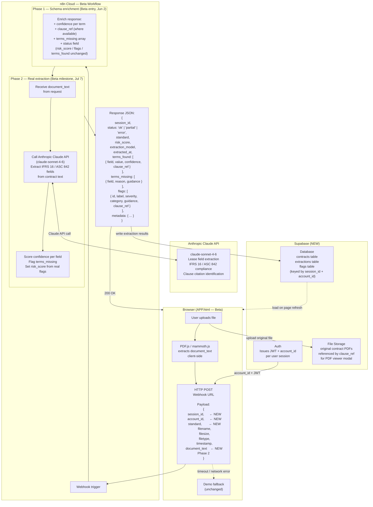

# Backend Architecture
**LegalGraph n8n Pipeline**
**Last updated: 2026-05-05**

---

## Current State

The backend is a single n8n cloud webhook. The frontend POSTs file metadata only — no document content is transmitted. n8n returns hardcoded demo JSON. No real AI extraction runs against the uploaded file.

### Current State — Key Gaps

| Gap | Impact |
|-----|--------|
| No document content sent to n8n | n8n cannot extract real data — all output is mock |
| No `confidence` scores in response | UI cannot distinguish reliable extractions from guesses |
| No `clause_ref` in response | PDF viewer (BUG-006) cannot be wired; audit trail has no source |
| No `session_id` / `account_id` in request | Per-account analytics and storage isolation impossible |
| No error envelope | UI shows generic "webhook unavailable" on any failure; no retry guidance |
| No `terms_missing` in response | UI cannot show which required fields were not found |
| No Supabase writes | Extraction results not persisted; page refresh = data loss (BUG-009) |
| n8n cold start can exceed 30s | AbortController timeout triggers false "unavailable" errors |

---

## Beta Target State

Three-phase migration (detailed in `BACKEND-PLAN.md`). By Beta start (Phase 1) the schema is enriched additively. By Beta milestone (Phase 2) real Claude extraction runs against `document_text`. Error envelopes and `clause_ref` ship at GA (Phase 3).

### Beta Target — Changes Required per Phase

**Phase 1 — By Beta entry (2026-06-02)**

| Change | Owner |
|--------|-------|
| Add `session_id`, `account_id`, `standard` to request payload | Frontend |
| Add `confidence` (0–1) to each `terms_found` entry | n8n |
| Add `terms_missing` array for fields not in contract | n8n |
| Add `status: ok / partial / error` to response | n8n |
| Add `clause_ref` where page/section can be identified | n8n |
| Frontend renders `confidence` indicators (<0.85 = low-confidence flag) | Frontend |
| Frontend renders `terms_missing` section in results panel | Frontend |

**Phase 2 — By Beta milestone (2026-07-07)**

| Change | Owner |
|--------|-------|
| Add PDF.js (PDF text extraction) to APP.html | Frontend |
| Add mammoth.js (DOCX text extraction) to APP.html | Frontend |
| Send `document_text` in webhook request (capped at 100k chars) | Frontend |
| n8n uses `document_text` to call Claude API for real extraction | n8n / AI |
| Remove demo-data fallback from n8n (keep client-side fallback) | n8n |
| Supabase: write extraction results on every successful run | Frontend |
| Supabase: load last extraction on page load (fixes BUG-009) | Frontend |

**Phase 3 — By GA entry (2026-07-14) — per BACKEND-PLAN.md**

| Change | Owner |
|--------|-------|
| Return structured error envelope on failure | n8n |
| Populate `metadata` block (word count, pages, lease type, jurisdiction) | n8n |
| Populate `complex_structure_flags` for subleases / variable rents | n8n |
| Wire `clause_ref` to PDF viewer modal (resolves BUG-006) | Frontend |
| Show `error_message` from envelope in toast instead of generic text | Frontend |

---

## Payload Evolution Summary

### Request

| Field | Current | Phase 1 | Phase 2 |
|-------|---------|---------|---------|
| `filename` | ✅ | ✅ | ✅ |
| `filesize` | ✅ | ✅ | ✅ |
| `filetype` | ✅ | ✅ | ✅ |
| `timestamp` | ✅ | ✅ | ✅ |
| `session_id` | — | ✅ NEW | ✅ |
| `account_id` | — | ✅ NEW | ✅ |
| `standard` | — | ✅ NEW | ✅ |
| `document_text` | — | — | ✅ NEW |
| `document_storage_ref` | — | — | ✅ NEW |

### Response

| Field | Current | Phase 1 | Phase 2 | Phase 3 |
|-------|---------|---------|---------|---------|
| `risk_score` | ✅ | ✅ | ✅ real | ✅ |
| `flags[].id/label/severity` | ✅ | ✅ | ✅ | ✅ |
| `flags[].category` | — | ✅ NEW | ✅ | ✅ |
| `flags[].clause_ref` | — | partial | ✅ | ✅ |
| `terms_found[].field/value` | ✅ | ✅ | ✅ real | ✅ |
| `terms_found[].confidence` | — | ✅ NEW | ✅ | ✅ |
| `terms_found[].clause_ref` | — | partial | ✅ | ✅ |
| `terms_missing` | — | ✅ NEW | ✅ | ✅ |
| `status` | — | ✅ NEW | ✅ | ✅ |
| `session_id` | — | ✅ NEW | ✅ | ✅ |
| `metadata` | — | — | — | ✅ NEW |
| `error` envelope | — | — | — | ✅ NEW |

---

## Infrastructure

| Component | Current | Beta |
|-----------|---------|------|
| Webhook host | n8n Cloud (cfalcon.app.n8n.cloud) | n8n Cloud (same) |
| AI model | None (mock) | claude-sonnet-4-6 via Anthropic API |
| Database | None | Supabase (Postgres) |
| File storage | None | Supabase Storage |
| Auth | None | Supabase Auth (magic link) |
| Frontend host | Netlify | Netlify (same) |
| Monitoring | None | n8n execution logs + Supabase dashboard |

---

*Owner: Engineering · Reviewed by: AI, Product · Last updated: 2026-05-05*
