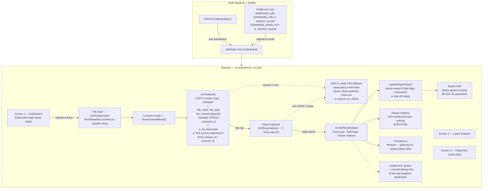
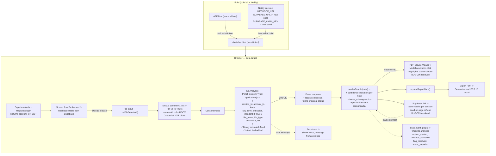

# Frontend Architecture
**LegalGraph SPA — `APP.html`**
**Last updated: 2026-05-05**

> Visual diagrams: see [`diagrams/frontend-current.png`](diagrams/frontend-current.png) and [`diagrams/frontend-beta.png`](diagrams/frontend-beta.png)

---

## Current State

A single-file HTML/CSS/JS SPA served from Netlify. No framework, no bundler. UI state lives in the DOM and is lost on page refresh. The file is read as base64 before being sent to n8n — but n8n expects a binary attachment, causing a format mismatch.



### Current State — Key Gaps

| Gap | Bug | Impact |
|-----|-----|--------|
| **Binary mismatch** — frontend sends base64 JSON, n8n expects binary file attachment | — | n8n `Extract from File` node fails; `$json.text = undefined`; extraction likely produces empty output |
| **No `intent` field** — n8n orchestrator reads `body.intent` which is never set | — | Orchestrator cannot detect intent; sub-agent routing may fail |
| **Response schema mismatch** — n8n returns `{contract_type, key_terms[]}`, frontend expects `{risk_score, flags[], terms_found[]}` | — | Frontend falls back to MOCK_ANALYSIS even on a 200 response |
| No PDF clause viewer | BUG-006 | Auditors cannot verify source clauses — hard Beta blocker |
| No persistence | BUG-009 | Page refresh destroys all extraction results |
| Supabase credentials injected but client never instantiated | BUG-009 | `SUPABASE_URL` + `SUPABASE_ANON_KEY` are in the build but unused |
| Event tracking stubs only | — | Cannot measure time-to-report or activation metrics |
| No auth / session identity | — | No `account_id` or `session_id` passed to n8n |
| Static lease dashboard | — | Screen 1 shows hardcoded rows, not real data |
| Export PDF not wired | — | Report gate works; PDF generation does not |

---

## Beta Target State

Fixes the binary mismatch by extracting document text client-side and sending as plain text. Adds Supabase auth + persistence, PDF.js/mammoth.js extraction, PDF clause viewer, and wired analytics.



### Beta Target — Changes Required

| Change | Addresses | Priority |
|--------|-----------|----------|
| Extract `document_text` client-side (PDF.js + mammoth.js); send as plain text | Binary mismatch | **P0 — fixes core extraction gap** |
| Add `intent: "key_term_extraction"` to POST payload | Missing intent field | **P0 — Beta entry** |
| Align frontend response parser to n8n's actual schema | Response schema mismatch | **P0 — Beta entry** |
| Build PDF viewer modal wired to `clause_ref` | BUG-006 | P0 — Beta entry |
| Instantiate Supabase JS client; write/read extraction results | BUG-009 | P0 — Beta entry |
| Wire `track()` to real analytics destination | Metric collection | P0 — Beta entry |
| Add Supabase Auth; pass `session_id` + `account_id` in request | Identity | P1 — Beta milestone |
| Drive Screen 1 lease table from Supabase rows | Dashboard | P1 — Beta milestone |
| Render `confidence` indicators and `terms_missing` section | UX | P1 — Beta milestone |
| Wire PDF export to real report generation | Export | P0 — Beta entry |

---

## Data Flow Summary

### Current
```
User uploads file
  → fileToBase64() converts file to base64 string
  → consent modal
  → POST {file_name, file_type, file_content (base64), standard, analyzed_at}
    Content-Type: text/plain
    ⚠️ No intent field — n8n orchestrator reads body.intent → undefined
    ⚠️ base64 JSON, not binary — n8n Extract from File fails
  → n8n pipeline runs but with undefined text → likely empty extraction
  → frontend receives {contract_type, key_terms[]} — schema mismatch → falls back to MOCK_ANALYSIS
  → results rendered from hardcoded mock data
  → results lost on page refresh
```

### Beta Target
```
User uploads file
  → PDF.js / mammoth.js extracts plain document_text client-side
  → consent modal
  → Supabase Auth resolves account_id + new session_id generated
  → POST {session_id, account_id, intent, standard, file_name, document_text}
  → n8n reads document_text, runs real extraction via OpenAI agents
  → n8n returns {contract_type, key_terms[], confidence, clause_ref, terms_missing, status}
  → frontend renders real results with confidence indicators
  → results saved to Supabase DB
  → clause citation click → PDF viewer modal at referenced page
  → results survive page refresh (loaded from Supabase)
  → all events emitted to analytics
```
