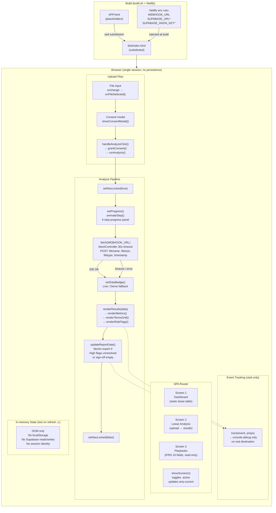
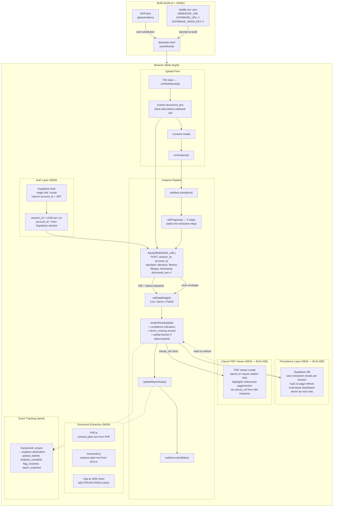

# Frontend Architecture
**LegalGraph SPA — `APP.html`**
**Last updated: 2026-05-05**

---

## Current State

A single-file HTML/CSS/JS SPA served from Netlify. No framework, no bundler, no persistent storage. All UI state lives in the DOM and is lost on page refresh.



### Current State — Key Gaps

| Gap | Bug | Impact |
|-----|-----|--------|
| No persistent storage | BUG-009 | Page refresh destroys all extraction results |
| No document text sent to n8n | — | n8n can only return demo data, not real extraction |
| No PDF viewer on clause citations | BUG-006 | Auditors cannot verify source clauses — hard blocker |
| Event tracking is stubs only | — | Cannot measure time-to-report or activation metrics |
| No auth / session identity | — | Multi-account isolation impossible; `account_id` never sent |
| Static lease dashboard | — | Screen 1 shows hardcoded rows, not real data |
| `SUPABASE_URL` + `SUPABASE_ANON_KEY` injected but never used | BUG-009 | Credentials are wired but no Supabase client instantiated |

---

## Beta Target State

Adds persistence, real document text extraction, a PDF clause viewer, wired event tracking, and Supabase auth. The single-file HTML structure is preserved — all additions are library includes and JS blocks within `APP.html`.



### Beta Target — Changes Required

| Change | Addresses | Priority |
|--------|-----------|----------|
| Add Supabase JS client; write extraction results to DB | BUG-009 | P0 — Beta entry |
| Add PDF.js + mammoth.js; extract `document_text` before webhook call | Phase 2 backend plan | P0 — Beta milestone |
| Build PDF viewer modal wired to `clause_ref` | BUG-006 | P0 — Beta entry (per PM review) |
| Wire `track()` to real analytics destination | Metric collection | P0 — Beta entry |
| Add Supabase Auth; pass `session_id` + `account_id` in request | Backend plan Phase 1 | P1 — Beta milestone |
| Drive Screen 1 lease table from Supabase rows | Dashboard gap | P1 — Beta milestone |
| Render `confidence` indicators and `terms_missing` section | Backend plan Phase 1 | P1 — Beta milestone |

---

## Data Flow Summary

### Current
```
User uploads file
  → consent modal
  → POST {filename, filesize, filetype, timestamp} to n8n
  → n8n returns demo/mock JSON (no real extraction)
  → render results in DOM
  → results lost on page refresh
```

### Beta Target
```
User uploads file
  → PDF.js / mammoth.js extracts document_text client-side
  → consent modal
  → Supabase Auth resolves account_id + new session_id
  → POST {session_id, account_id, standard, ..., document_text} to n8n
  → n8n runs real Claude extraction, returns terms + confidence + clause_ref
  → render results; save to Supabase
  → clause citation click → PDF viewer modal at referenced page
  → results survive page refresh (loaded from Supabase)
  → all events emitted to analytics
```
